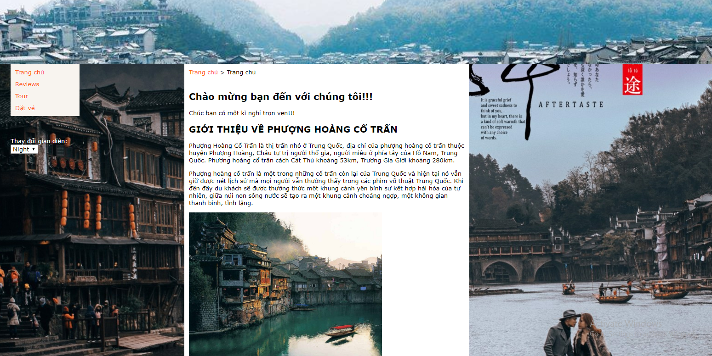

# WEBSITE ĐẶT VÉ DU LỊCH PHƯỢNG HOÀNG CỔ TRẤN: #

Trang gồm 2 giao diện DARK và NIGHT

## Giao diện Dark: ##

## Giao diện Night: ##

Trang có 4 thành phần: 
## TRANG CHỦ: ##

 Giới thiệu tổng quan về lịch sử hình thành của Phượng Hoàng cổ trấn.Đây được xem là một trong những điểm du lịch hấp dẫn tại Trung Quốc. Thành cổ Phượng Hoàng hay Phượng Hoàng Cổ Trấn được biết đến là một trong những thành cổ từ đời nhà Thanh, là bảo tàng sống của các dân tộc. Nơi đây thu hút với vẻ bình yên, tĩnh lặng nhưng không kém phần thơ mộng. Đến đây, bạn sẽ có dịp ngắm cầu Hồng Kiều duyên dáng với màu sắc đỏ rực vào mỗi tối của đèn lồng hay được thưởng thức cảm giác tuyệt vời khi phiêu diêu trên thuyền thưởng thức cảnh đẹp, cuộc sống đa dạng.
 
## REVIEWS: ##

Tổng quát tất cả kinh nghiệm du lịch,giấy tờ và thủ tục,Chi phí đi phượng hoàng cổ trấn, phương tiện đi lại, khách sạn,....

khi mua sắm tại Trung Quốc chỉ sử dụng đồng Nhân Dân Tệ. Chỉ ở các trung tâm siêu thị lớn mới có quầy đổi ngoại tệ nhưng tỉ giá thấp hơn ngân hàng. Đặc biệt khi mua sắm , đổi tiền và thối tiền, bạn lưu ý về vấn đề tiền giả với tờ 100 Tệ.
Những điều cần lưu ý khi du lịch 
+ Đối với du khách Việt Nam đi du lịch đến Trung Quốc phải xin thị thực nhập cảnh tại Việt Nam hay tại cửa khẩu nế di chuyển bằng đường bộ.
+ Giờ ở Trung Quốc đi trước giờ Việt Nam một tiếng (GMT 8+).
+ Điện thoại: Hầu hết du khách có thể dùng điện thoại ngay tại phòng của các khách sạn cùng bảng hướng dẫn  sử dụng. Cách rẻ, tiện lợi hơn là Quý khách nên mua sim trả tiền trước đề sử dụng tại Trung Quốc, gọi đi quốc tế hay gọi về Việt Nam. Gọi điện thoại  ở Trung Quốc: (0086 ) + số điện thoại.
+ Trung Quốc sử dụng điện thế 220 volt và ổ cắm 2, hoặc 3 chấu vuông.
+ Khi du lịch, đó mỗi khách du lịch bị giới hạn mang vào Trung Quốc tương đương tối đa 6.000 tệ một lần. 
+ Trang phục khi đi du lịch tùy theo mùa mà mang theo quần áo phù hợp. Nếu đi vào mùa hè thì nên mặc những trang phục lịch sự, sáng màu với chất liệu vải dễ hút mồ hôi, ngoài ra cũng nên mang theo áo khoác nhẹ đề phòng những cơn mưa có thể khiến thời tiết se lạnh. Nếu đi vào mùa đông thì nhớ mang theo áo ấm. Mùa xuân và mùa hè không khí mát mẻ, chỉ cần mang áo khoác nhẹ là được. (mùa xuân ở Bắc Kinh vẫn rất lạnh). 
+ Khi tham quan các Chùa chiền, Đền đài, Di tích Văn hóa, Lịch sử… có những yêu cầu khắt khe như sau: Nam mặc quần áo lịch thiệp, không mặc quần short và không mang dép lê; Nữ mặc trang phục kín đáo lịch sự, không mặc váy ngắn, quần áo lửng, quần áo mỏng, áo không cánh tay, quần bó, dép không quai hậu… 
Thông tin liên hệ cần thiết

Xem nội dung đầy đủ tại: https://travel.com.vn/kinh-nghiem/du-lich-trung-quoc.aspx
Nguồn: travel.com.vn

## TOUR: ##
Các tour hiện có sẵn và dự định thời gia khởi hành. Trong Tour có nêu các loại dịch vụ tổng chi phí của Tour:

+ Hàng không Vietnam Airlines bay thẳng đến Đồng Nhân KHÔNG QUÁ CẢNH 
+ Thành cổ Phượng Hoàng – điểm đến lý tưởng cho du khách thưởng thức cả về cảnh sắc và giá trị văn hoa lịch sử Trung Quốc 
+ Cổ Trấn Phù Dung (cổ trấn trên thác) với nét đẹp thơ mộng, là một trong 10 cổ trấn đẹp nhất Trung Quốc. 
+ Thiên Môn Sơn – nổi tiếng với con đường pha lê lên trời và hệ thống cáp treo dài nhất, bao quát khung cảnh núi đồi cao nhất thế giới (Bao gồm chi phí một chiều xe sinh thái + xe cáp treo) 
+ Tham quan núi Viên Gia Giới bằng thang máy Bạch Long ngoài trời, lớn và cao nhất thế giới
+ Trải nghiệm cây cầu kính nổi tiếng rộng 6m, dài 430m, bắc qua 2 vách đá ở độ cao 300m và nhìn xuống công viên Trương Gia Giới
+ Dạo quanh và mua sắm tại cửa hàng trà, cửa hàng tơ lụa, cửa hàng đá cẩm thạch hay tiệm thuốc bắc nổi tiếng của tỉnh Hồ Nam
+ Quý khách CLICK vào ĐẶT VÉ trang sẽ chuyển sang trang ĐẶT Vé. Quý khách vui lòng nhập thông tin bản thân

## ĐẶT VÉ: ##
Quý Khách điền đầy đủ thông tin của mình và gửi về cho trang. Trang sẽ phản hồi lại cho quý khách và sẽ hiển thi thông tin của quý khách qua bảng khách Tour bên dưới.
 
## Bảng Tour thể hiện thông tin quý khách đã gửi về cho trang: ##
+ Thông qua bảng Tour chúng tôi có thể thống kê số lượng khách cho một chuyến đi và lập kế hoạch về thời gian cụ thể cho chuyến đi.
+Trong bảng có 2 cột đặc biệt đó là cột LOẠI VÉ và Chú Thích:

## Loại vé cho biết quyết định của quý khách đã chọn loại vé trong trang TOUR

## Chú Thích: Quý khách có thể nêu ra những yêu cầu riêng của bản thân. ví dụ như: quý khách muốn ở phòng đơn hoặc phòng đôi, cũng có thể là phòng đặc biệt. Hoặc có thể là vấn đề sức khỏe của quý khách....v.v. Chúng tôi sẽ ghi nhận và lập ra một kế hoạch hoàn chỉnh. 

CHÚC QUÝ KHÁCH CÓ MỘT KÌ NGHỈ TRỌN VẸN!!!!!
