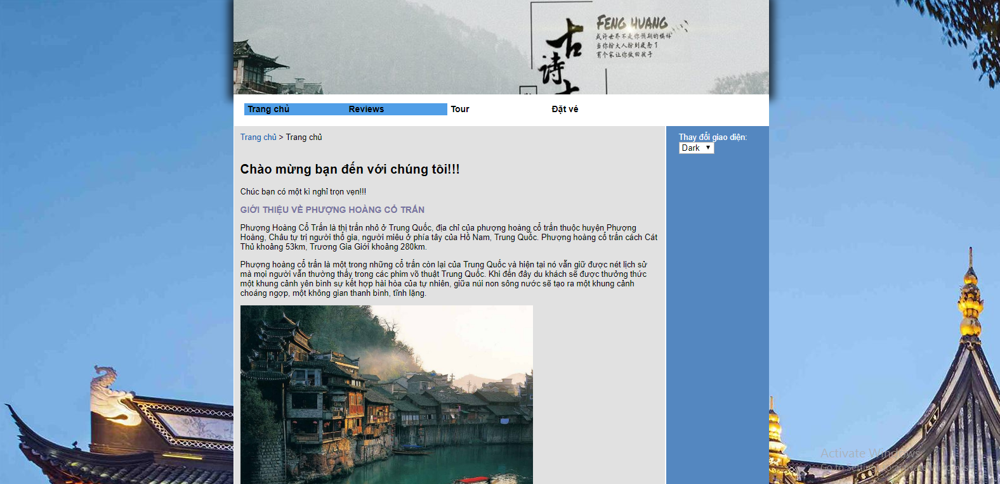
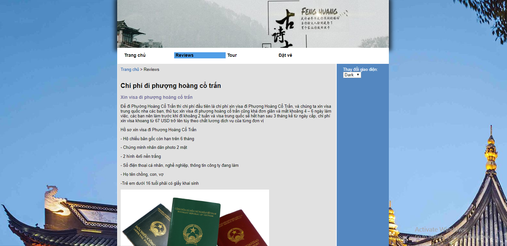
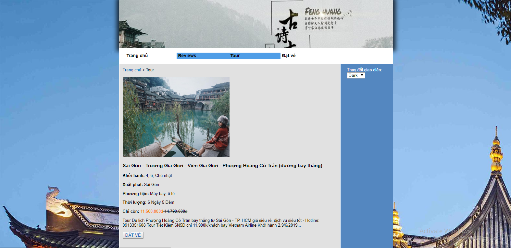
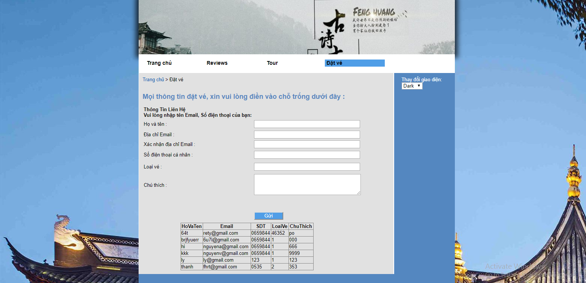

#WEBSITE ĐẶT VÉ DU LỊCH PHƯỢNG HOÀNG CỔ TRẤN:#

Trang gồm 2 giao diện DARK và NIGHT

##Giao diện Dark:##

Giao diện Night:

Trang có 4 thành phần: 
 TRANG CHỦ: 
 Giới thiệu tổng quan về lịch sử hình thành của Phượng Hoàng cổ trấn những địa điểm nổi tiếng và đặc sản của trấn
 REVIEWS: Tổng quát tất cả kinh nghiệm du lịch,giấy tờ và thủ tục,Chi phí đi phượng hoàng cổ trấn, phương tiện đi lại, khách sạn,....

 TOUR: Các tour hiện có sẵn và dự định thời gia khởi hành. Trong Tour có nêu các loại dịch vụ tổng chi phí của Tour, gồm 2 loại vé 

 ĐẶT VÉ: Quý Khách điền đầy đủ thông tin của mình và gửi về cho trang. 

